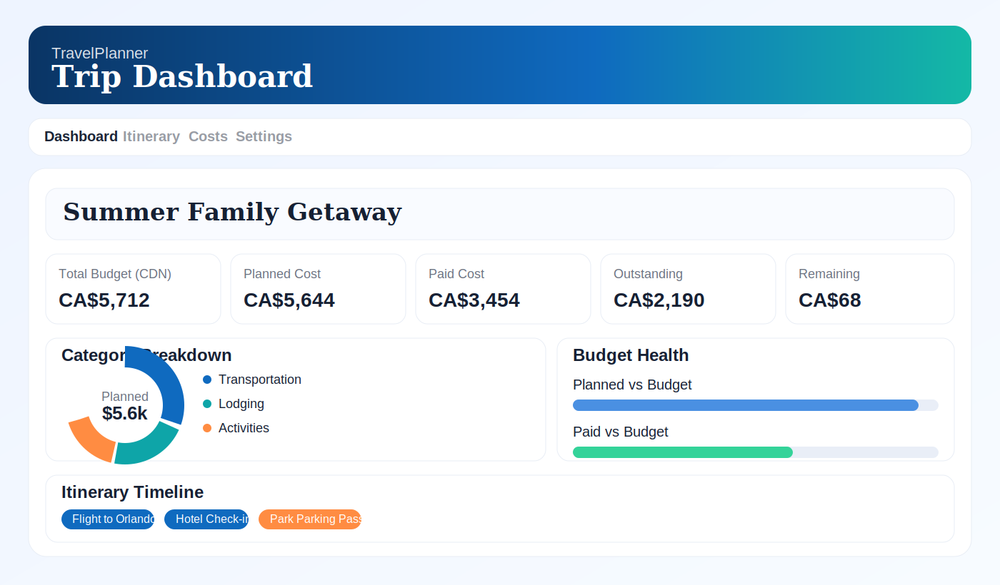
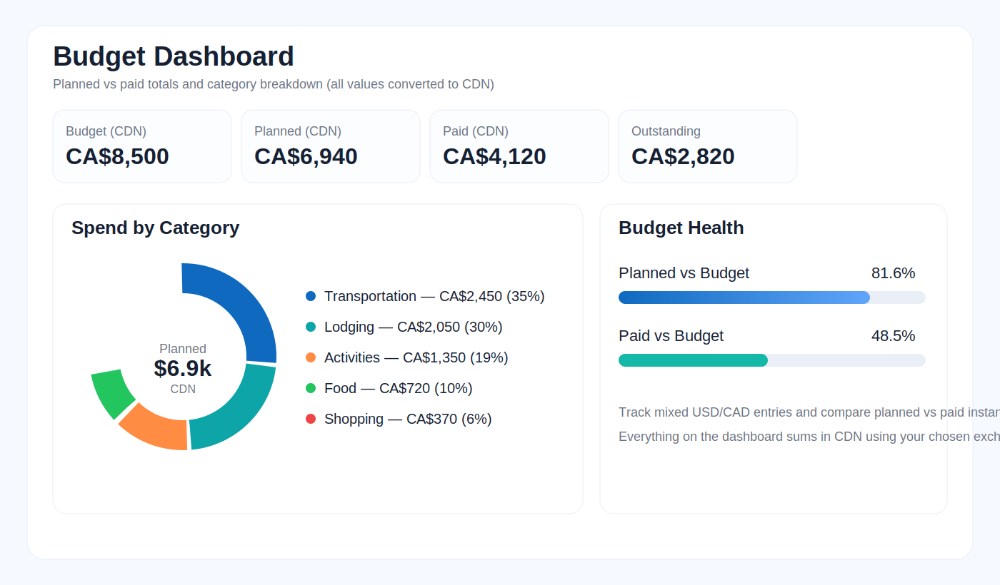
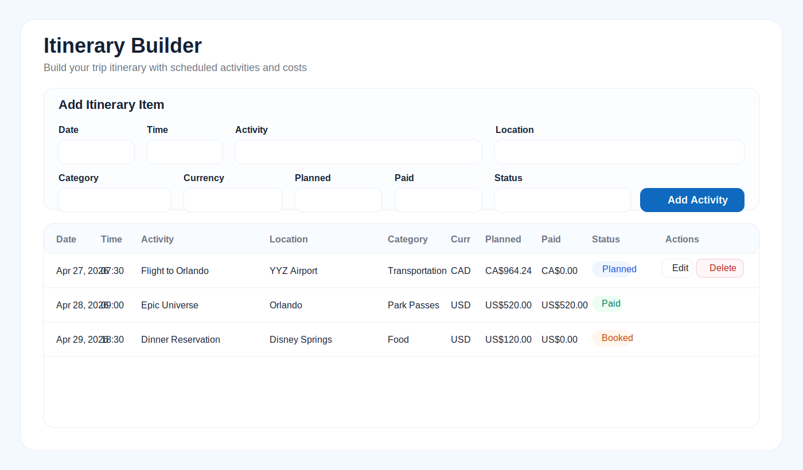
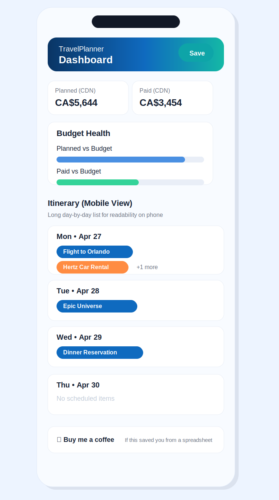

# TravelPlanner

Plan your trip, track your budget, and manage your itinerary — private, simple, and offline. No account required.

A local-first travel planning app for itinerary building, budget tracking, and printable trip summaries that runs entirely in your browser.

## Try It Now

- Live demo (GitHub Pages): [https://ashleysnl.github.io/TravelPlanner/](https://ashleysnl.github.io/TravelPlanner/)
- If the demo link is not live yet, enable GitHub Pages (steps in [Deployment](#deployment)) and GitHub will publish the app at the URL above.

## Buy Me a Coffee

[](https://buymeacoffee.com/ashleysnl)

Plain link: https://buymeacoffee.com/ashleysnl

## Why TravelPlanner

- No login / no account required
- Offline / local-first (browser storage)
- Privacy-first (no tracking, no analytics, no cloud dependency)
- Simple to use and fast to start
- Works on desktop and mobile
- Printable trip summary for sharing as PDF

## Screenshots

### Dashboard



### Budget Tracking



### Itinerary Builder



### Mobile View



## Quick Start

### Local (no npm required)

1. Download or clone this repo.
2. Open `index.html` in your browser.
3. Start planning immediately. Data is stored locally in your browser.

Optional local server (useful for iPhone testing on your network):

```bash
cd "TravelPlanner"
python3 -m http.server 8000 --bind 0.0.0.0
```

Then open `http://localhost:8000` (or your Mac's LAN IP on iPhone/iPad).

## Deployment

### GitHub Pages (recommended)

1. Push this repo to GitHub (branch: `main`).
2. Open your GitHub repository settings.
3. Go to `Settings` -> `Pages`.
4. Under **Build and deployment**, set:
   - **Source**: `Deploy from a branch`
   - **Branch**: `main` / `/ (root)`
5. Save.
6. Wait for the GitHub Pages deployment to finish.
7. Your live app URL will be:
   - `https://ashleysnl.github.io/TravelPlanner/`

## GitHub Optimization (Suggested)

### Repository description (copy/paste suggestion)

`Offline travel planner, itinerary manager, and trip budget tracker. No login. Privacy-first. Static web app.`

### Suggested topics

`travel`, `itinerary`, `budget`, `offline`, `localstorage`, `javascript`, `webapp`, `planner`, `privacy`, `trip-planner`

## Data & Privacy

- Data is stored in browser `localStorage` on your device
- JSON backup export/import is included for manual backups and device transfers
- No login, no tracking, no account, no backend

## Star the Repo

If TravelPlanner was useful, please star the repo so more people can find it.

## Support

If this saved you from building a spreadsheet, consider supporting it ☕

- Buy Me a Coffee: https://buymeacoffee.com/ashleysnl

## More Tools

Other tools (coming soon):

- Budget helpers (coming soon)
- Family planning templates (coming soon)
- Printable trackers (coming soon)
- Travel checklists (coming soon)

## License

MIT License. See [LICENSE](LICENSE).
